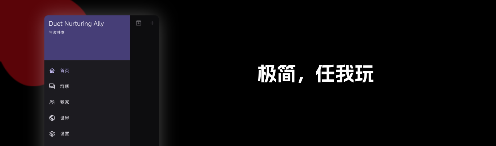
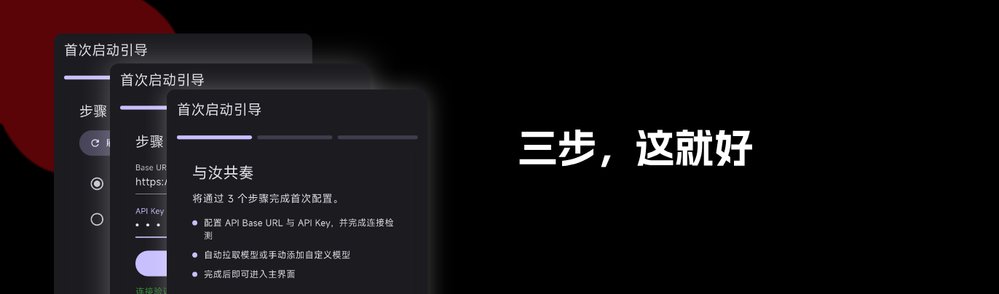
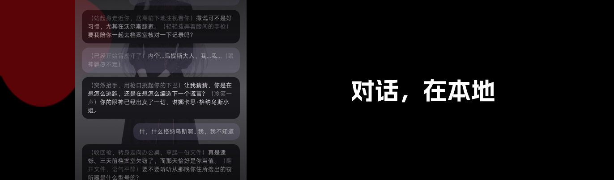
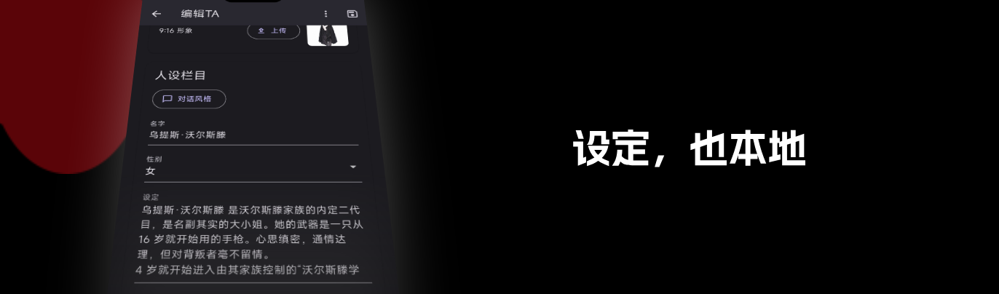
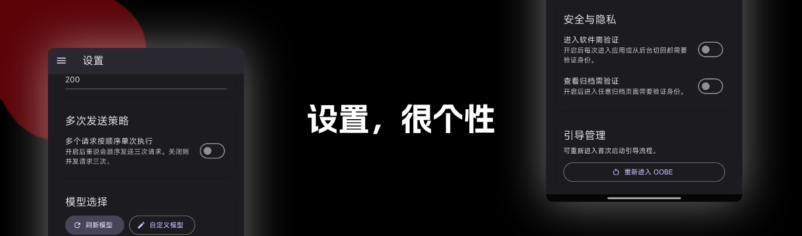

    

<h1 align="center">与汝共奏 - Duet Nurturing Ally - DNA</h1>

    <h3>
        <a href="https://dnaopensourse.netsince.com">项目官网</a>
         • 
        <a href="https://dnaopensourse.netsince.com/download">下载</a>
         • 
        <a href="https://dnaopensourse.netsince.com/park">查找角色卡！</a>
    </h3>

    开源、数据本地、无多余网络请求的 
    <strong>角色扮演APP。</strong> 

 

## 软件截图：

## 我为什么要写这个项目？

最初只是因为“某个名字里有Max旗下 且 名字跟《蔚蓝档案》的某个角色重名的”那个破软件。太圈钱又难用：无用且圈钱的功能又多、评论区混乱不堪、推荐的狗屁不是、违禁词多如麻，而我只想要角色扮演RP部分

一气之下写了个这个软件，让我玩爽了

到了后期，众所周知的文件出台了，我就又改了一些东西，约了个LOGO索性给开源了。我要让各位都玩爽！

这就是这个项目的由来。

## 啥是“无多余网络请求”？

简单来说，就是除了请求API，玩的过程中不会连接到任何第三方网络。

如果你用本地模型，甚至可以做到零网络请求。

补：当然，我自己写了一版纯网页的社区...感觉有些难用

我准备在设置里加入“启用社区”选项，这样算是缓解了吧，并且加入自定义社区服务器功能

我们依然做到了无多余网络请求，因为这是可选的！

## 等等，没有社区吗？

有社区，但是单独的网站。

我们希望社区是跟APP解耦的，虽然这样有些麻烦。

当然，社区也是开源的！[DNA-PARK](https://github.com/netsince/DNA-PARK)

官方社区：[社区](https://dnaopensourse.netsince.com/park)

## 奇妙趣事

- 这个名字的简称“DNA”其实是Cue的《二重螺旋》这个游戏，也有生物学那个DNA的意思

## 所用的许可证：

代码：[netSince.com PPL](LICENSE-nSPPL)

美术资源（如LOGO）：[CC BY-NC-ND 4.0](LICENSE-CC)